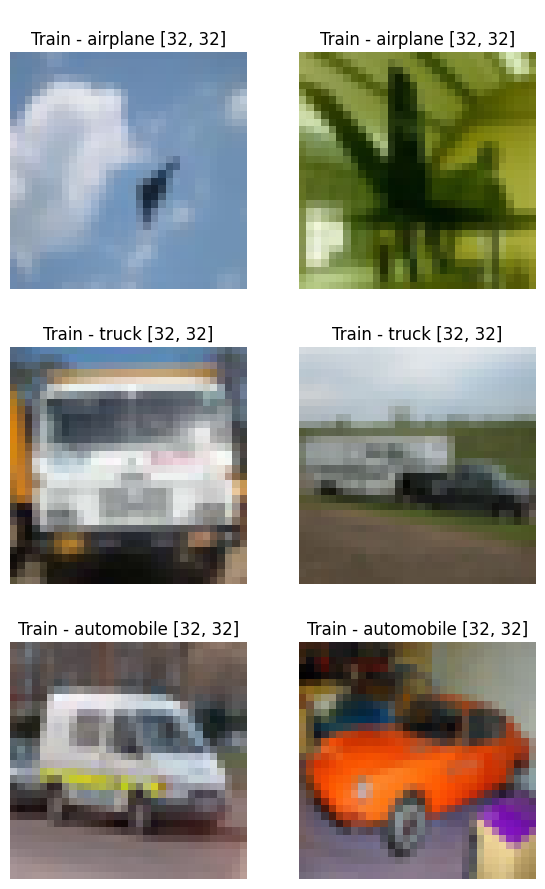
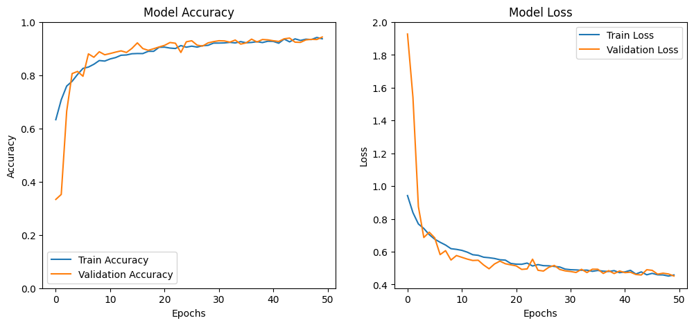
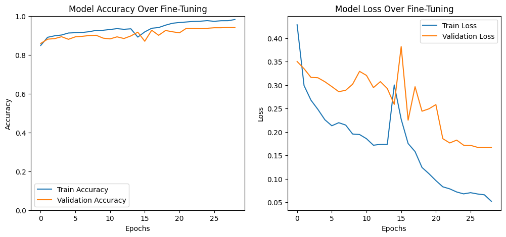
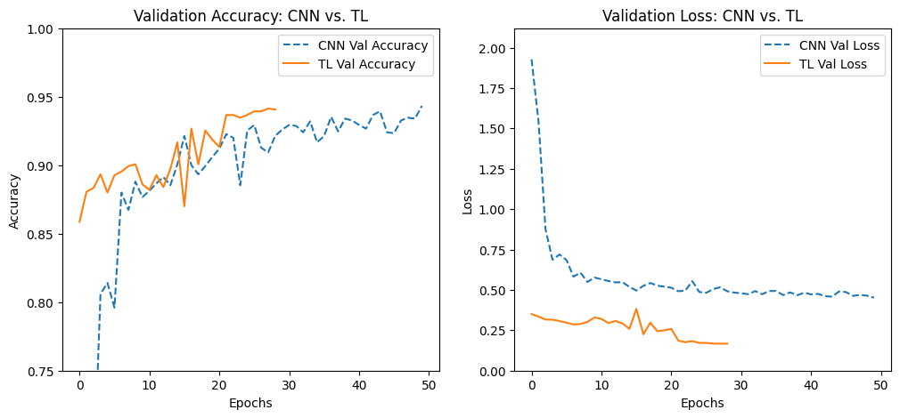
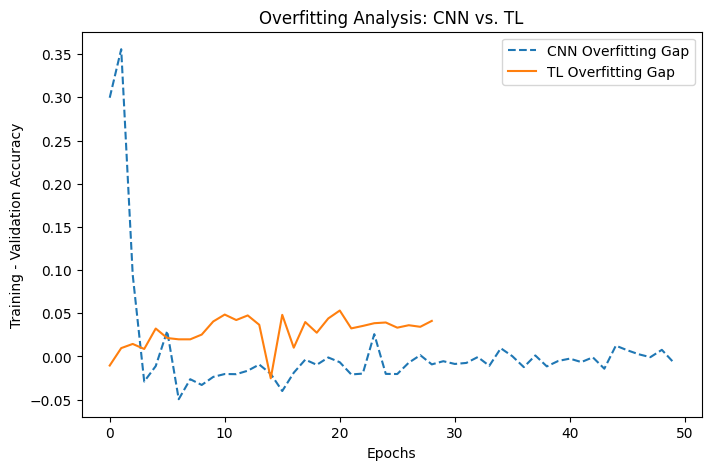
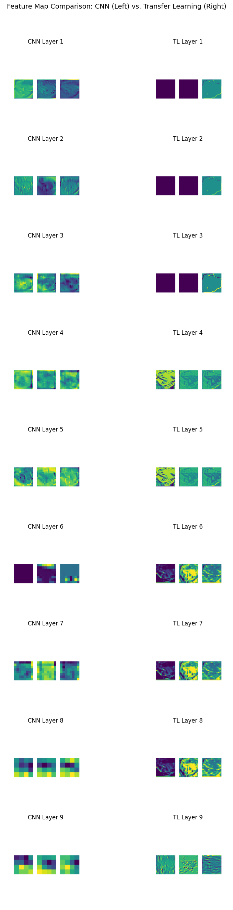

# 🍒 CherryPick: Deep Learning for Vehicle Type Classification

A deep learning project to classify transport modes—**airplane**, **automobile**, and **truck**—using a **custom CNN** and a **MobileNetV2 transfer learning model**. Built using TensorFlow/Keras in Colab as part of the EGT214 Deep Learning Module at NYP.

---

## 💡 Objective

Develop two deep learning models for image classification and compare them in terms of design, performance, and optimization:

* **CNN\_model\_233523A**: A Cherry-Pick CNN model combining ideas from VGG, ResNet, MobileNet, and EfficientNet
* **TL\_model\_233523A**: A transfer learning model using MobileNetV2

---

## 📅 Dataset

* Source: `dataset_transport` (Brightspace)
* Classes: `airplane`, `automobile`, `truck`
* Training images: 6000
* Test images: 1500
* Resolution: **32×32×3**

### ⚠️ Dataset Limitations

* Low-resolution images limit meaningful feature extraction
* Small training size increases overfitting risk


---

## 🧠 Model 1 – Cherry-Pick CNN (Final CNN)

This model blends state-of-the-art techniques:

* **Swish** activation (EfficientNet)
* **Residual connections** (ResNet)
* **Depthwise separable convolutions** (MobileNet)
* **Squeeze-and-Excitation (SE) block** for channel attention
* **VGG-style conv blocks**
* **Label smoothing** (0.1) to prevent overconfidence

### 🧱 Architecture Flow

```text
Input: 32x32x3
→ 2×Conv2D(32) + BN + Swish → MaxPool → Dropout(0.1)
→ ResidualBlock(64) → MaxPool → Dropout(0.1)
→ DepthwiseConv + PointwiseConv(128) → MaxPool → Dropout(0.1)
→ ResidualBlock(128)
→ Squeeze-and-Excitation (SE)
→ GlobalAveragePooling
→ Dense(128) + Swish → Dropout(0.3)
→ Dense(3, softmax)
```

### ⚙️ Training Details

* Optimizer: Adam (lr = 0.0005)
* Loss: Categorical Crossentropy (label smoothing = 0.1)
* Regularization: L2 + Dropout
* Callbacks: EarlyStopping, ReduceLROnPlateau, ModelCheckpoint

### ✅ Performance

* **Train Accuracy**: 93.45%
* **Val Accuracy**: **93.80%**
* Overfitting Gap: **−0.0035**
* Inference Time: 0.66s

> This lightweight hybrid CNN clearly outperforms earlier CNN attempts, balances depth and efficiency, and adapts well to low-resolution inputs.


---

## 🔁 Model 2 – Transfer Learning with MobileNetV2

MobileNetV2 is selected for its compatibility with **low-resolution inputs** and its **lightweight architecture**, ideal for upscaled 96×96 image inputs.

### 🧪 Strategy Overview

* **Phase 1**: Feature Extraction (15 epochs, lr = 0.001, all layers frozen)
* **Phase 2**: Unfreeze last 50 layers, lr = 0.0001
* **Phase 3**: Unfreeze last 100 layers, lr = 0.00001

### 🧰 Architecture

```text
NASNetMobile (pre-trained, frozen)
→ GlobalAveragePooling2D
→ BatchNormalization
→ Dense(128, relu)
→ Dropout(0.4)
→ Dense(3, softmax)
```

### ⚙️ Augmentation & Preprocessing

* Inputs scaled to **96×96**, normalized to \[-1, 1] (MobileNetV2 requirement)
* Augmentation used:

  * Rotation, shift, zoom, shear, flip (same as CNN)

### ✅ Performance

* **Train Accuracy**: 97.57%
* **Val Accuracy**: **94.13%**
* Overfitting Gap: 0.0343
* Inference Time: 3.12s

> Despite being slightly overfitted, this model extracted both **low-level** and **high-level** features effectively with minimal preprocessing and smart scheduling.


---

## ⚙️ Tools & Libraries

* Python (Kaggle Notebook)
* TensorFlow / Keras
* Custom blocks: Swish, Residual, SE, Depthwise Conv
* Transfer learning: NASNetMobile, preprocess\_input
* Visualization: Matplotlib, Seaborn

---

## 🧪 Notebook Structure

```
CherryPick_DeepLearning_model.ipynb
├── Data Augmentation & Visualization
├── CherryPick CNN_model_233523A
├── TL_model_233523A (NASNetMobile)
├── Metrics & Evaluation
├── Final Comparison
```

---

## 📊 Final Comparison

| Metric                | Custom CNN  | Transfer Learning (TL) |
| --------------------- | ----------- | ---------------------- |
| Validation Accuracy   | **94.33%**  | 94.13%                 |
| Training Accuracy     | 93.67%      | **97.57%**             |
| Overfitting Gap       | **−0.67%**  | 3.43%                  |
| Training Time (Total) | **568s**    | 714s                   |
| Time per Epoch        | **11.37s**  | 23.82s                 |
| Inference Speed       | **1.03s**   | 3.12s                  |
| Model Size            | **4.67 MB** | 9.81 MB                |
| No. of Parameters     | **393k**    | 2.43M                  |
| Trainable Params      | –           | 2.34M                  |
| Non-trainable Params  | –           | 85.95k                 |


### 🧠 Comparison Summary

The custom CNN model clearly wins in terms of efficiency and deployment readiness. While the TL model achieves slightly higher training accuracy, it shows signs of overfitting. Given the small dataset and only 3 output classes, transfer learning provides limited benefit.

* **Custom CNN**

  * ✅ Fully customizable and light
  * ✅ Small model size, faster inference
    − ⚠️ Requires architecture design knowledge
    − ⚠️ Development from scratch is resource-heavy

* **Transfer Learning**

  * ✅ High initial accuracy and implementation ease
    − ⚠️ Larger, slower, and prone to overfitting
    − ⚠️ Needs more compute resources




---

## 📌 Key Learnings

* Custom CNNs require careful engineering for low-res tasks
* MobileNetV2/NASNetMobile perform strongly even with small datasets
* Label smoothing, dropout, and scheduling are key to generalization
* Smart fine-tuning of pre-trained models significantly boosts performance

---

## 👤 Author

\[Year 2, Applied Deep Learning Assignment, Diploma in AI & Data Engineering, Nanyang Polytechnic]
\[**Min Phyo Thura**](https://github.com/myriosMin)

---

Thanks for checking out **CherryPick** — a project that benchmarks smart CNN design vs. transfer learning under tight data constraints. 🚀
